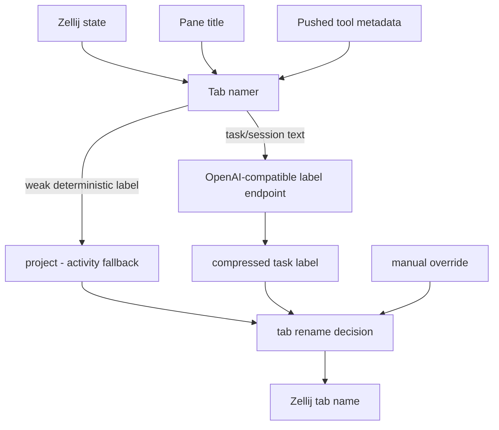
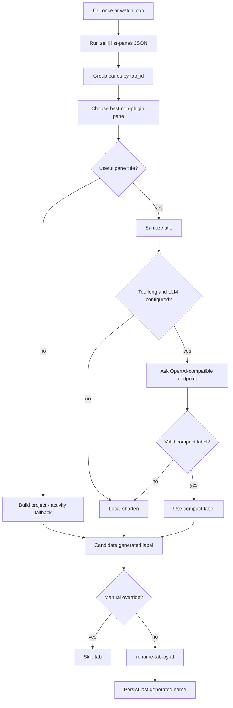

# Zellij Tab Namer - Plan

## Goal Capsule

- **Objective:** Build a Zellij tab-naming system that keeps every tab scannable without manual renaming, using exposed pane titles as the primary task signal, deterministic inference as the fallback, and LLM compression when titles are too long.
- **Product authority:** The Product Contract in this file is authoritative. Planning may choose the first implementation slice, but it must not change the confirmed naming behavior without returning to product scope.
- **Execution profile:** Code work targets the `zellij-tab-namer` source repo first. This dot-config repo keeps the plan, glossary, and later integration wiring.
- **Stop conditions:** Stop if Zellij CLI JSON no longer exposes pane `title`, `tab_id`, and `tab_name`, or if a planned rename path would overwrite clear manual tab names without protection.
- **Tail ownership:** LFG owns implementation, verification, review follow-up, local commits, and remote shipping where a remote exists.

---

## Product Contract

### Summary

Build a hybrid Zellij tab namer that manages all tabs. Zellij-exposed pane titles are the primary task label source, deterministic `project - activity` labels are the fallback, and long task/session titles can be compressed by an LLM into short labels such as `skills/agents monorepo`.

### Problem Frame

The current failure mode is too many open tabs that keep default numbered names. The panes already carry useful Codex/Claude context in their frame titles, but that context does not automatically become the tab name.

Manual renaming solves the immediate scan problem, but it does not scale when tabs are created frequently or when the work inside a tab changes.

The first product win is not perfect semantic understanding. The first win is eliminating unnamed tab drift with stable, low-noise labels that are useful even when the LLM or agent integration is unavailable.

### Key Decisions

- **Pane title first.** The namer should read each pane's exposed `title` from Zellij state and use the best non-plugin pane title as the first semantic candidate for the tab name.
- **Hybrid push plus inference.** Pane titles cover the immediate Codex/Claude use case, push integrations remain available for tools that can provide richer metadata, and inference still names ordinary shell/editor tabs.
- **LLM as label compressor.** The model turns pane titles or pushed task/session text into a short label; it is not responsible for reading terminal contents or discovering context by itself.
- **OpenAI-compatible routing contract.** The product should target endpoint fields such as `base_url`, `api_key`, `model`, `max_label_chars`, and `timeout_ms` so Ollama, LiteLLM, or a cloud provider can be swapped by config.
- **Manual tab names are protected.** A user rename becomes an override until the tab name is cleared or a re-enable command is sent.
- **Two-repo boundary.** This dot-config repo consumes the built artifact and stores personal integration config; `eduardoleal/zellij-tab-namer` owns source code, tests, protocol docs, and release artifacts.
- **Product Contract preservation:** Product Contract unchanged except for the previously confirmed pane-title-first refinement.



### Actors

- A1. **User:** Works across many Zellij tabs and needs labels that remain useful without manual upkeep.
- A2. **Zellij tab namer:** Owns label priority, fallback inference, debouncing, cache behavior, and tab rename decisions.
- A3. **Title and push integrations:** Pane-frame titles, Claude hooks, shell hooks, or future agent integrations that provide task/session metadata to the namer.
- A4. **Label endpoint:** Optional OpenAI-compatible model endpoint used only to shorten allowed metadata into a compact tab label.

### Requirements

**Naming behavior**

- R1. Every managed tab must receive a useful label when deterministic context is available, so default numbered names do not persist as the normal state.
- R2. A non-default pane title from the chosen non-plugin pane must be treated as the primary task label candidate for that tab.
- R3. Unknown or ordinary tabs must fall back to `project - activity`, where project comes from working-directory context and activity comes from the focused process or command.
- R4. A known task label must take precedence over the fallback when pane title or pushed metadata is available and the label can be made short enough for the configured tab width.
- R5. Claude/agent tabs must use the exposed pane title or an exact session/task name when a reliable source provides one; otherwise they must generate a compact label from allowed prompt or metadata context.
- R6. LLM-generated labels must respect a configured maximum size and favor short human-readable labels over full prompt text.

**Privacy and model boundary**

- R7. The MVP may send only exposed pane titles, pushed metadata, exact session/task names when available, and the latest user prompt to the label endpoint.
- R8. The MVP must not send visible pane text or scrollback to the label endpoint.
- R9. If the label endpoint is unavailable, slow, or misconfigured, the namer must silently use the raw shortened title or deterministic fallback and keep working.
- R10. LLM calls must be asynchronous from Zellij startup and normal tab creation, so naming never adds user-visible startup delay.

**Control and stability**

- R11. Manual tab names must be treated as protected overrides until cleared or explicitly re-enabled.
- R12. Generated names must be debounced and cached so tabs do not churn while work is ongoing.
- R13. The namer must avoid replacing a good existing generated label with a weaker fallback unless the source context materially changes.
- R14. The system must expose a way for push integrations to send, update, and clear task metadata for the active tab or a stable tab identifier.

**Configuration and packaging**

- R15. The dot-config repo must store the consumed plugin artifact, Zellij config wiring, permission notes, and personal hook wiring.
- R16. The source repo must own plugin source, any companion CLI or daemon source, tests, release workflow, and protocol documentation.
- R17. The product must not require LiteLLM specifically; LiteLLM is an allowed router behind the OpenAI-compatible endpoint contract.

### Key Flows

- F1. **Ordinary shell/editor tab naming**
  - **Trigger:** A tab opens or its focused pane context changes.
  - **Actors:** A1, A2
  - **Steps:** The namer reads Zellij-visible state, chooses the best non-plugin pane title when present, otherwise builds a `project - activity` label, debounces the update, and renames the tab if no manual override blocks it.
  - **Outcome:** The tab has a useful label without any LLM dependency.
  - **Covered by:** R1, R2, R3, R10, R12

- F2. **Claude title compression**
  - **Trigger:** A Claude/Codex pane exposes a long task title, or a hook pushes a session name, task name, or latest user prompt.
  - **Actors:** A2, A3, A4
  - **Steps:** The namer accepts the pane title or pushed metadata, asks the configured label endpoint for a compact label when needed, validates size, caches the result, and applies it when stronger than the fallback.
  - **Outcome:** A long prompt such as `create monorepo for skills and agents` can appear as a compact label such as `skills/agents monorepo`.
  - **Covered by:** R4, R5, R6, R7, R14

- F3. **LLM outage fallback**
  - **Trigger:** The label endpoint is unavailable, times out, or returns unusable output.
  - **Actors:** A2, A4
  - **Steps:** The namer discards the failed label attempt, keeps or applies the raw shortened title or deterministic fallback, and may retry later without blocking the user.
  - **Outcome:** Tabs remain named and usable even when model routing is broken.
  - **Covered by:** R9, R10, R13

- F4. **Manual override protection**
  - **Trigger:** The user manually renames a tab.
  - **Actors:** A1, A2
  - **Steps:** The namer detects or is told that the name is manual, records the override, and ignores future generated labels until the override is cleared or re-enabled.
  - **Outcome:** User intent wins over automation.
  - **Covered by:** R11

### Acceptance Examples

- AE1. **Covers R1, R2.** Given a Claude/Codex pane title `Implement B3 slice 4 specifications`, when the namer observes the tab, then the tab name is derived from that title instead of remaining `Tab #...`.
- AE2. **Covers R1, R3.** Given a new shell tab in this Zellij config repo with no useful pane title, when no pushed metadata exists, then the tab eventually shows a deterministic label like `dot-config-zellij - fish` instead of a default number-only name.
- AE3. **Covers R4, R5, R6, R7.** Given a pane title or prompt `create monorepo for skills and agents`, when the label endpoint succeeds, then the tab can become `skills/agents monorepo` or an equivalently compact label within the configured size limit.
- AE4. **Covers R8.** Given a Claude session with visible output and scrollback, when the label endpoint is called, then the request payload excludes visible pane text and scrollback.
- AE5. **Covers R9, R10.** Given the model endpoint is offline, when a Claude/Codex pane exposes a useful title, then the tab still receives or keeps a raw shortened title or deterministic fallback without blocking Zellij startup or tab creation.
- AE6. **Covers R11.** Given the user manually renames a tab to `prod deploy`, when new metadata arrives for that tab, then the tab name remains `prod deploy` until the override is cleared or re-enabled.
- AE7. **Covers R12, R13.** Given repeated prompts or pane focus changes inside the same task, when the task label is already good, then the tab does not keep changing names.

### Success Criteria

- No active tab with deterministic context remains in a default number-only naming state after the namer has had a chance to observe it.
- Claude/agent tabs receive task labels from their exposed pane titles, with compact labels when the model endpoint is available.
- The system remains useful with the model endpoint disabled or unavailable.
- The MVP never sends terminal pane contents or scrollback to a model endpoint.
- Manual renames remain stable until the user clears or re-enables automation.

### Scope Boundaries

- Reading visible pane text or scrollback is out of scope for the MVP.
- Full terminal summarization is out of scope; the LLM only compresses exposed pane titles and allowed metadata.
- Perfect Claude session-name extraction is out of scope when Claude does not expose the name through a reliable integration point.
- Building or vendoring an LLM router is out of scope; use Ollama directly, LiteLLM, or a cloud endpoint through configuration.
- Keeping plugin source inside this dot-config repo is out of scope; this repo consumes the built artifact and records local integration.

#### Deferred to Follow-Up Work

- Build a native Zellij WASM plugin after the CLI watcher proves the naming policy.
- Add committed `config.kdl` startup wiring only after the watcher command and install path settle.
- Add a push-metadata protocol after pane-title mirroring covers the immediate Codex/Claude use case.

### Dependencies / Assumptions

- Zellij exposes pane titles, tab IDs, and tab names through application state or CLI JSON, and can rename tabs by stable ID.
- Zellij plugin APIs provide the needed primitives to read pane/tab state, receive pipe messages, use async workers, and rename tabs by stable ID.
- A new headless plugin will require explicit plugin permission grants in the local Zellij permission cache, following the existing repo guidance for headless/status-bar plugins.
- Codex/Claude-style CLIs continue to publish useful task context through pane titles; hooks or related shell integrations can still push extra metadata when needed.
- The local source checkout for `eduardoleal/zellij-tab-namer` has been initialized, and the remote repository can be created later.

### Sources / Research

- `config.kdl` currently owns keybindings, plugin aliases, and `load_plugins` wiring.
- `layouts/default.kdl` renders tab names through zjstatus using `{name}`.
- Local verification showed `zellij action list-panes --json --all` exposes pane `title`, `tab_id`, `tab_name`, `pane_command`, and `pane_cwd`, including Codex/Claude task titles.
- `CONCEPTS.md` defines headless plugin, status-bar plugin, plugin permission grant, pane title, deterministic tab label, pushed tab metadata, and manual tab-name override vocabulary.
- `docs/solutions/integration-issues/zjstatus-hints-permission-prompt-behind-pane.md` documents the local permission-grant trap for headless/status-bar plugins.
- Zellij Plugin API docs describe state reads, tab renaming, permissions, pipes, and workers: `https://zellij.dev/documentation/plugin-api-commands.html`, `https://zellij.dev/documentation/plugin-pipes.html`, `https://zellij.dev/documentation/plugin-api-permissions.html`, `https://zellij.dev/documentation/plugin-api-workers.html`.
- Claude Code hook docs describe hook input/output and async command hooks: `https://code.claude.com/docs/en/hooks`.
- Ollama documents OpenAI-compatible local endpoints: `https://docs.ollama.com/api/openai-compatibility`.
- LiteLLM documents proxy routing and Ollama support: `https://docs.litellm.ai/docs/simple_proxy`, `https://docs.litellm.ai/docs/providers/ollama`.

---

## Planning Contract

### Key Technical Decisions

- KTD1. **Ship a CLI watcher before a WASM plugin.** The first implementation uses Zellij's existing CLI JSON and `rename-tab-by-id`, deferring plugin permissions and WASM packaging until the naming policy is proven.
- KTD2. **Mirror pane titles before asking an LLM.** The primary path sanitizes and shortens the best pane title; the LLM is used only when endpoint configuration exists and the source title exceeds the local size limit. (session-settled: user-approved — chosen over pushed-metadata-first: local verification showed Codex/Claude task titles already appear as pane titles.)
- KTD3. **Protect manual names by comparing against generated state.** The watcher stores the last generated name per tab and treats a non-default current name that differs from that stored value as manual.
- KTD4. **Use Python stdlib for the proof of concept.** Python keeps the first source repo small, testable with `unittest`, and dependency-free while the eventual plugin boundary remains open.
- KTD5. **Use two repositories.** The dot-config repo keeps the plan and future integration wiring, while `zellij-tab-namer` owns executable source and tests. (session-settled: user-approved — chosen over storing source in dot-config: the source repo avoids mixing plugin/daemon build tooling into a config repository.)

### High-Level Technical Design



### Assumptions

- The first shippable slice should be a companion CLI watcher rather than a native plugin.
- A local shortening fallback is acceptable when the LLM endpoint is absent, slow, or returns unusable output.
- The source repo can ship locally without a remote because the user plans to create the remote later.

### Output Structure

**Target repo:** `zellij-tab-namer`

```text
.
├── README.md
├── pyproject.toml
├── src/
│   └── zellij_tab_namer/
│       ├── __init__.py
│       ├── cli.py
│       ├── llm.py
│       └── naming.py
└── tests/
    ├── test_cli.py
    ├── test_llm.py
    └── test_naming.py
```

### System-Wide Impact

- The watcher changes live Zellij tab names, so dry-run mode is required before users run it continuously.
- The first implementation avoids headless plugin permissions, so it does not require editing or unfreezing the Zellij permission cache.
- The LLM boundary remains metadata-only; tests must cover that pane contents and scrollback are not accepted as label inputs.

### Risks & Dependencies

- **Multiple clients can mark different panes as focused.** The pane selection rule must prefer useful non-floating task titles before shell floating panes.
- **Manual override detection can produce false positives after state loss.** The watcher should default to skipping suspicious non-default names rather than overwriting them.
- **Model endpoints can be unavailable.** LLM compression must fail closed to local shortening and never block naming.

---

## Implementation Units

### U1. Source Package Scaffold

- **Goal:** Create a dependency-free Python package in `zellij-tab-namer` with a console entry point and testable modules.
- **Requirements:** R15, R16, R17, KTD4, KTD5
- **Dependencies:** None
- **Target repo:** `zellij-tab-namer`
- **Files:** `pyproject.toml`, `README.md`, `src/zellij_tab_namer/__init__.py`
- **Approach:** Define package metadata, a `zellij-tab-namer` console script, supported Python version, and basic usage documentation.
- **Patterns to follow:** Keep source repo build tooling out of `dot-config-zellij`; keep dependencies empty for the first slice.
- **Test scenarios:** Test expectation: none -- scaffolding is verified by package import and later CLI tests.
- **Verification:** The package imports with `python3 -m unittest` using only the standard library.

### U2. Pane Selection and Naming Policy

- **Goal:** Implement pure naming logic that turns Zellij pane JSON into tab rename candidates without shelling out.
- **Requirements:** R1, R2, R3, R4, R9, R11, R12, R13, AE1, AE2, AE5, AE6, AE7, KTD2, KTD3
- **Dependencies:** U1
- **Target repo:** `zellij-tab-namer`
- **Files:** `src/zellij_tab_namer/naming.py`, `tests/test_naming.py`
- **Approach:** Model panes and rename decisions from dictionaries, ignore plugin/exited panes, prefer useful focused non-floating pane titles, fall back to project/activity labels, sanitize noisy title prefixes, enforce max length, and detect manual overrides from persisted generated-name state.
- **Execution note:** Start with unit tests using captured representative pane dictionaries before wiring subprocess calls.
- **Test scenarios:** Covers AE1. A tab with a Codex/Claude pane title produces a rename from that title rather than a default tab name.
- **Test scenarios:** Covers AE2. A shell tab with no useful title falls back to a project/activity label.
- **Test scenarios:** Covers AE5. When local compression cannot call a model, a long useful title is locally shortened rather than dropped.
- **Test scenarios:** Covers AE6. A non-default current tab name that differs from stored generated state is treated as a manual override and skipped.
- **Test scenarios:** Covers AE7. Repeated input that resolves to the current generated name produces no rename.
- **Verification:** Unit tests cover selection order, title sanitation, fallback naming, truncation, and manual override cases.

### U3. OpenAI-Compatible Label Compression

- **Goal:** Add optional label compression through an OpenAI-compatible chat endpoint without making the endpoint required.
- **Requirements:** R5, R6, R7, R8, R9, R10, AE3, AE4, AE5, KTD2
- **Dependencies:** U2
- **Target repo:** `zellij-tab-namer`
- **Files:** `src/zellij_tab_namer/llm.py`, `src/zellij_tab_namer/naming.py`, `tests/test_llm.py`, `tests/test_naming.py`
- **Approach:** Read endpoint settings from CLI options or environment, submit only title/metadata text to a chat-completions-compatible endpoint, validate the returned label against max length, and fall back to local shortening on timeout, HTTP failure, parse failure, or empty output.
- **Execution note:** Keep the HTTP client injectable so tests never make network calls.
- **Test scenarios:** Covers AE3. A long title is compressed when a fake endpoint returns a valid short label.
- **Test scenarios:** Covers AE4. The compression request includes only the source title and max label constraints, not pane output or scrollback fields.
- **Test scenarios:** Covers AE5. Timeout, malformed response, or overlong model output falls back to local shortening.
- **Verification:** Unit tests prove request payload shape, success extraction, and all fallback paths without external services.

### U4. Zellij CLI Runner

- **Goal:** Implement the executable watcher that reads Zellij panes, plans renames, applies safe renames, and persists generated-name state.
- **Requirements:** R1, R9, R10, R11, R12, R13, AE1, AE2, AE5, AE6, AE7, KTD1, KTD3
- **Dependencies:** U2, U3
- **Target repo:** `zellij-tab-namer`
- **Files:** `src/zellij_tab_namer/cli.py`, `tests/test_cli.py`
- **Approach:** Provide `once` and `watch` subcommands, support `--dry-run`, `--interval`, `--max-chars`, `--state-file`, `--no-llm`, and `--force`, parse `zellij action list-panes --json --all`, call `zellij action rename-tab-by-id` only for safe decisions, and update state after successful renames.
- **Execution note:** Treat live Zellij interaction as a smoke path; unit tests should inject command runners.
- **Test scenarios:** Dry-run prints planned renames and does not call `rename-tab-by-id`.
- **Test scenarios:** A successful once-run calls `list-panes`, renames only tabs with candidates, and saves generated state.
- **Test scenarios:** Command failure or invalid JSON returns a non-zero CLI result with a clear stderr message.
- **Test scenarios:** `--force` bypasses manual override protection for a deliberate one-off refresh.
- **Verification:** Unit tests cover command construction, state persistence, dry-run behavior, failure handling, and force behavior.

### U5. Documentation and Local Integration Notes

- **Goal:** Document how to install, dry-run, run once, run as a watcher, and later wire the source artifact into the dot-config repo.
- **Requirements:** R15, R16, R17, AE1, AE2, AE5
- **Dependencies:** U4
- **Target repo:** `zellij-tab-namer`
- **Files:** `README.md`
- **Approach:** Explain the title-mirror MVP, privacy boundary, LLM environment variables, dry-run-first workflow, manual override behavior, and the current local-only repo state.
- **Test scenarios:** Test expectation: none -- documentation is verified by command examples matching implemented CLI options.
- **Verification:** README commands match the CLI parser and mention that native plugin packaging is deferred.

---

## Verification Contract

| Gate | Applies to | Done signal |
|---|---|---|
| Unit tests | U2, U3, U4 | `python3 -m unittest discover -s tests` passes in `zellij-tab-namer`. |
| Package import | U1 | `python3 -m zellij_tab_namer.cli --help` exits successfully from the source repo. |
| Dry-run smoke | U4, U5 | `python3 -m zellij_tab_namer.cli once --dry-run` reads live Zellij JSON and prints planned changes without renaming tabs. |
| Git hygiene | All units | Source repo and dot-config repo contain only intentional changes before commits. |

---

## Definition of Done

- The `zellij-tab-namer` repo contains a runnable Python CLI with no third-party runtime dependencies.
- The CLI can derive labels from pane titles, fall back to project/activity, and avoid overwriting manual tab names.
- LLM compression is optional, metadata-only, timeout-bounded, and covered by tests with a fake HTTP client.
- Unit tests and dry-run smoke verification pass.
- The README documents dry-run-first usage, model configuration, manual override behavior, and the deferred native-plugin path.
- The implementation removes dead-end code and leaves no abandoned experiment paths in the diff.
