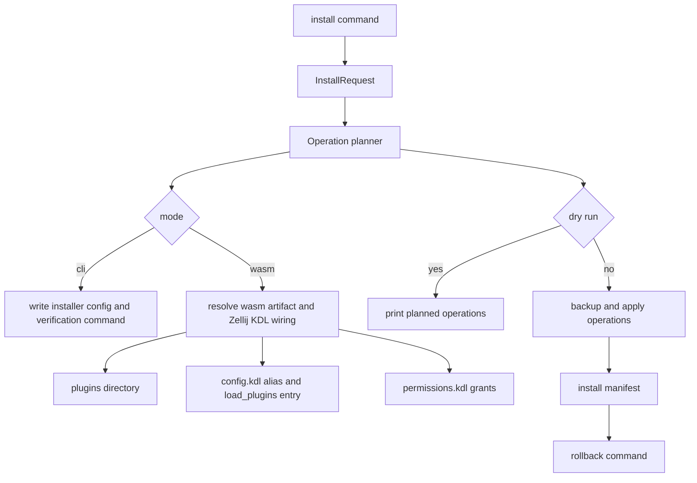

# Zellij Tab Namer Installer - Plan

## Goal Capsule

- **Objective:** Define an installer for `zellij-tab-namer` that sets up the current CLI watcher and the native WASM plugin path with one stable setup experience.
- **Product authority:** This Product Contract owns installer behavior, safety boundaries, user-facing modes, and success criteria. Planning decides the implementation shape.
- **Execution profile:** Code work targets `eduardoleal/zellij-tab-namer` first. This dot-config repo records local Zellij integration expectations.
- **Open blockers:** The WASM plugin artifact does not exist yet, so plugin-mode install behavior must be specified as a first-class path but may initially report that no release artifact is available.

---

## Product Contract

### Summary

Build a dual-mode installer for `zellij-tab-namer`.
The installer should set up the existing CLI watcher now and support native WASM plugin setup when that artifact exists, while applying Zellij config and permission-cache changes with backups and without killing active sessions by default.

### Problem Frame

Comparable Zellij plugins such as `room`, `harpoon`, and `zbuffers` use a simple pattern: place a `.wasm` file under `~/.config/zellij/plugins/`, then add a Zellij config snippet.
That pattern is not enough for `zellij-tab-namer` because its useful mode is automatic/background naming rather than a manually launched floating pane.

The local Zellij config already uses plugin aliases and `load_plugins`, and the local docs record a permission-cache trap for headless/status-bar plugins.
An installer that only downloads a file would leave the highest-risk steps to manual editing: config mutation, permission grants, durable backups, and activation guidance.

### Key Decisions

- **Dual-mode installer.** The installer supports CLI watcher setup now and WASM plugin setup as a first-class mode, so the user-facing command does not need to change when the native plugin ships. (session-settled: user-directed - chosen over CLI-only: the user explicitly selected both paths plus the WASM plugin.)
- **Apply with backups.** The default behavior mutates Zellij config and permission cache files directly, but every mutation must create a restorable backup first. (session-settled: user-directed - chosen over patch-only: the user selected automatic application with backups.)
- **No session kill by default.** The installer must not run destructive activation steps such as deleting all Zellij sessions unless the user passes an explicit flag. (session-settled: user-directed - chosen over full auto: the user selected apply-with-backups behavior that avoids restart or kill by default.)
- **Plugin-style install conventions.** WASM setup should follow the common Zellij plugin convention of installing a release `.wasm` into the configured plugins directory and wiring Zellij config to reference it.
- **Source repo owns installer source.** The `zellij-tab-namer` repo owns installer code, tests, release integration, and user-facing install docs; this dot-config repo owns personal config examples and permission notes.

### Actors

- A1. **User:** Wants tab naming to work without hand-editing multiple Zellij files or remembering permission-cache edge cases.
- A2. **Installer:** Owns artifact installation, config edits, permission-cache edits, backups, checks, and activation guidance.
- A3. **Zellij runtime:** Reads config and permission grants on new sessions and runs CLI or WASM naming behavior.
- A4. **Release source:** Provides the CLI package or WASM artifact that the installer installs.

### Requirements

**Install modes**

- R1. The installer must expose a CLI watcher setup path that installs or verifies the current Python package and leaves the `zellij-tab-namer` command runnable.
- R2. The installer must expose a WASM plugin setup path that installs or verifies a native `.wasm` artifact when one is available.
- R3. The installer must support a combined setup path that installs the best currently available runtime and records whether CLI mode, WASM mode, or both are active.
- R4. If the requested WASM artifact is unavailable, the installer must report that clearly and still allow CLI mode to complete when requested.

**Zellij integration**

- R5. The installer must detect the user's Zellij config directory and plugin directory, defaulting to the conventional `~/.config/zellij` layout when no override is provided.
- R6. The installer must install WASM artifacts into the configured Zellij plugins directory using a stable filename.
- R7. The installer must update Zellij config so the tab namer is wired in the appropriate mode without duplicating existing equivalent entries.
- R8. The installer must preserve existing user keybindings, plugin aliases, layouts, and comments except for the minimal changes needed to activate the tab namer.
- R9. The installer must support a dry-run mode that shows planned file, config, permission, and activation changes without writing them.

**Permission and safety**

- R10. Before editing any Zellij config or permission-cache file, the installer must create a timestamped backup next to the original or in a clearly reported backup directory.
- R11. For headless/plugin startup mode, the installer must manage required Zellij plugin permission grants when the requested permissions are known.
- R12. On macOS, when the installer successfully pre-grants headless/plugin permissions in `permissions.kdl`, it must leave the cache protected against Zellij rewriting those grants away. If the file is immutable, the installer must thaw it before editing and restore the immutable flag afterward; if the file starts mutable, the installer must freeze it after a successful grant unless the user explicitly opts out.
- R13. If permission-cache editing fails or the cache format is not safely understood, the installer must stop before partial permission mutation and tell the user what remains manual.
- R14. The installer must not run `zellij delete-all-sessions --force`, kill Zellij servers, or restart sessions unless the user passes an explicit activation flag.

**Configuration and model routing**

- R15. The installer must support configuring core naming options such as max label length, state file location, interval, and LLM disabled/enabled state.
- R16. The installer must support OpenAI-compatible label endpoint settings without requiring a specific router such as LiteLLM.
- R17. The installer must avoid storing secrets in committed dot-config files by default.

**Verification and recovery**

- R18. After installation, the installer must run or print a verification step that proves the installed mode can observe Zellij state without renaming tabs unexpectedly.
- R19. The installer must provide a rollback command or documented rollback path that restores backups and removes installed artifacts created by the installer.
- R20. Installer output must clearly distinguish complete setup, setup that needs a fresh Zellij session, and setup blocked by missing artifact, permissions, or unsupported platform behavior.

### Key Flows

- F1. **CLI watcher setup**
  - **Trigger:** The user runs the installer for the current implementation path.
  - **Actors:** A1, A2, A3
  - **Steps:** The installer checks prerequisites, installs or verifies the Python package, prepares config/state locations, applies safe Zellij integration changes with backups, and runs a dry-run verification command.
  - **Outcome:** The user has a working CLI watcher setup path and knows whether a fresh Zellij session is required.
  - **Covered by:** R1, R3, R5, R7, R9, R10, R14, R18, R20

- F2. **WASM plugin setup**
  - **Trigger:** The user asks for native plugin installation or runs combined setup after a WASM artifact exists.
  - **Actors:** A1, A2, A3, A4
  - **Steps:** The installer resolves the release artifact, installs it into the plugins directory, wires startup config, applies known permission grants with backups, and reports activation status.
  - **Outcome:** The native plugin is installed and ready for a fresh Zellij session without manual config editing.
  - **Covered by:** R2, R4, R5, R6, R7, R10, R11, R12, R13, R14, R20

- F3. **Safe dry run**
  - **Trigger:** The user runs the installer with dry-run mode.
  - **Actors:** A1, A2
  - **Steps:** The installer detects paths, current config, permission state, and available artifacts, then prints planned changes without writing files.
  - **Outcome:** The user can inspect the full setup plan before any mutation.
  - **Covered by:** R5, R8, R9, R20

- F4. **Rollback**
  - **Trigger:** The user wants to undo installer changes.
  - **Actors:** A1, A2
  - **Steps:** The installer restores selected backups or prints exact restore steps, removes installer-created artifacts when requested, and leaves unrelated user config untouched.
  - **Outcome:** The user can recover from a bad install without manually reconstructing previous config.
  - **Covered by:** R10, R19

### Acceptance Examples

- AE1. **Covers R1, R18.** Given no WASM artifact exists yet, when the user runs combined setup, then CLI watcher setup completes and verification uses dry-run behavior rather than renaming tabs unexpectedly.
- AE2. **Covers R2, R4.** Given the user requests WASM mode and no release `.wasm` is available, when the installer runs, then it reports the missing artifact and does not pretend plugin setup succeeded.
- AE3. **Covers R7, R8.** Given `config.kdl` already contains unrelated plugins and keybindings, when the installer wires the tab namer, then existing entries remain intact and duplicate tab-namer entries are not added.
- AE4. **Covers R10, R12.** Given `permissions.kdl` is managed on macOS, when known headless plugin grants are added, then the installer backs up the file, thaws it if needed, edits it, and leaves the cache frozen afterward unless the user explicitly opts out.
- AE5. **Covers R13.** Given permission-cache parsing or writing fails, when the installer reaches permission setup, then it stops before unsafe partial mutation and reports the manual step still required.
- AE6. **Covers R14, R20.** Given active Zellij sessions exist, when setup completes without an explicit restart flag, then the installer does not delete sessions and tells the user a fresh session is needed if applicable.
- AE7. **Covers R19.** Given installer-created config changes and artifacts exist, when rollback runs, then the previous config can be restored from backups and installer-created artifacts can be removed without touching unrelated plugins.

### Success Criteria

- A fresh user can install the CLI watcher path without manually editing Zellij config files.
- WASM plugin mode has a defined installer contract even before the plugin artifact exists.
- Every file mutation has a backup and a clear rollback path.
- Running the installer does not destroy or restart active Zellij sessions unless explicitly requested.
- The installer handles the local headless-plugin permission trap rather than leaving it as tribal knowledge.

### Scope Boundaries

#### Deferred for later

- Building the native WASM plugin itself.
- Publishing release automation for the WASM artifact.
- Supporting package managers such as Homebrew, Nix, or cargo-binstall.
- Cross-platform permission-cache hardening beyond behavior that can be verified during planning and implementation.

#### Outside this product's identity

- Replacing general Zellij plugin managers.
- Managing unrelated Zellij plugins beyond preserving existing config.
- Reading terminal pane contents or scrollback during install validation.
- Requiring LiteLLM, Ollama, or any one model router as the only supported label endpoint.

### Dependencies / Assumptions

- The current CLI watcher remains available in `eduardoleal/zellij-tab-namer`.
- Zellij config continues to support plugin aliases and startup plugins through `load_plugins`.
- Zellij CLI and plugin APIs continue to expose the state and rename primitives used by the tab namer.
- Required WASM plugin permissions will be knowable from the plugin source before plugin-mode install becomes active.
- The installer can safely parse and rewrite the subset of KDL needed for config and permission-cache edits, or it will stop rather than guessing.

### Sources / Research

- `docs/plans/2026-07-03-001-feat-zellij-tab-namer-plan.md` defines the existing tab-namer product contract and two-repo boundary.
- `docs/solutions/integration-issues/zjstatus-hints-permission-prompt-behind-pane.md` documents the local headless/status-bar permission grant trap.
- `config.kdl` uses plugin aliases and `load_plugins`; `layouts/default.kdl` renders tab names through `zjstatus`.
- `eduardoleal/zellij-tab-namer` currently contains the Python CLI watcher and tests.
- `rvcas/room` publishes `room.wasm` as a release asset and documents copying it into `~/.config/zellij/plugins`: `https://github.com/rvcas/room`.
- `Nacho114/harpoon` documents building `harpoon.wasm` and moving it into `~/.config/zellij/plugins`: `https://github.com/Nacho114/harpoon`.
- `Strech/zbuffers` publishes `zbuffers.wasm` as a release asset and documents latest-release download into `~/.config/zellij/plugins`: `https://github.com/Strech/zbuffers`.
- Zellij docs describe plugin aliases, `load_plugins`, plugin permissions, plugin commands, and CLI tab renaming: `https://zellij.dev/documentation/plugin-aliases.html`, `https://zellij.dev/documentation/plugin-loading.html`, `https://zellij.dev/documentation/plugin-api-permissions.html`, `https://zellij.dev/documentation/plugin-api-commands.html`, `https://zellij.dev/documentation/cli-actions`.

---

## Planning Contract

### Product Contract Preservation

Product Contract unchanged.

### Key Technical Decisions

- KTD1. **One installer CLI, pure planning core.** Add an `install` subcommand backed by a dependency-free installer module that first builds a list of file/config/permission operations, then either prints them in dry-run mode or applies them. This keeps behavior testable without a live Zellij server.
- KTD2. **Dual-mode setup is a stable interface.** Keep `cli`, `wasm`, and `both` as installer modes even though only CLI mode can fully complete today; WASM mode must be explicit about unavailable artifacts rather than disappearing from the product surface. (session-settled: user-directed - chosen over CLI-only: the user explicitly selected both paths plus the WASM plugin.)
- KTD3. **Apply with timestamped backups.** Every mutating operation against `config.kdl`, `permissions.kdl`, installer config, manifests, or installed artifacts creates a timestamped backup or records that the file did not previously exist. (session-settled: user-directed - chosen over patch-only: the user selected automatic application with backups.)
- KTD4. **No disruptive activation by default.** The installer reports when a fresh Zellij session is needed and may print an activation command, but it must not delete sessions or restart servers unless a future explicit activation flag is implemented. (session-settled: user-directed - chosen over full auto: the user selected apply-with-backups behavior that avoids restart or kill by default.)
- KTD5. **WASM owns Zellij startup wiring.** CLI mode installs/verifies the watcher, writes local installer config, and produces the exact watch command; WASM mode owns `plugins {}` alias insertion, `load_plugins {}` startup wiring, artifact placement, and permission-cache grants because Zellij can run that mode headlessly.
- KTD6. **Text-scoped KDL mutation, not a full parser.** Use conservative block-scoped editing for the known `plugins {}` and `load_plugins {}` shapes and stop when the structure is missing or ambiguous. This preserves comments and unrelated config while avoiding an unvetted parser dependency.
- KTD7. **Rollback is manifest-backed.** Each apply run writes an installer manifest under the tab-namer config directory so rollback can restore the latest backup set and remove installer-created artifacts without guessing.

### Assumptions

- CLI watcher setup does not make Zellij start the Python watcher automatically from `config.kdl`; automatic headless startup is a WASM-plugin responsibility.
- The first implementation can support a user-supplied local WASM path and a placeholder release URL, while treating missing artifacts as a nonfatal block for CLI-compatible `both` mode.
- Permission-cache mutation can be implemented safely for known permission names and exact absolute `.wasm` paths; unknown permission requirements are reported instead of inferred.

### High-Level Technical Design

The installer is a planner plus an operation applier. The planner can be exercised entirely against temporary directories and fixture text. The applier is the only layer that writes files, thaws macOS immutable flags, downloads artifacts, or records rollback state.

### Implementation Constraints

- Keep runtime dependencies at zero; use the Python standard library.
- Treat file mutation as opt-in through `install`; existing `once` and `watch` behavior must not change.
- Write code paths so unit tests can inject temporary Zellij config, plugin, permission, and backup locations.
- Preserve user config by inserting only idempotent, clearly named tab-namer entries.

### Risks & Dependencies

- Zellij's permission cache is owner-managed and may be rewritten by a running server; installer output must explain that grants apply on fresh sessions and that durable headless grants require freezing `permissions.kdl` on macOS unless the user explicitly opts out.
- KDL text mutation can be wrong if the config shape diverges from expected blocks; the implementation must stop on ambiguity instead of attempting broad rewrites.
- WASM artifact availability is outside this repository until the native plugin exists; the first installer must clearly separate "CLI installed" from "WASM unavailable."

---

## Implementation Units

### U1. Installer Operation Core

- **Goal:** Add a testable installer core that resolves paths, modes, options, planned operations, backups, manifests, and dry-run output without mutating files during planning.
- **Requirements:** R1, R3, R5, R9, R10, R15, R16, R17, R20; KTD1, KTD2, KTD3, KTD7.
- **Dependencies:** None.
- **Files:** `src/zellij_tab_namer/installer.py`, `tests/test_installer.py`.
- **Approach:** Model install inputs as simple dataclasses or immutable request objects, return operation records with human-readable summaries, and keep filesystem writes behind an apply layer. Default paths should resolve from `HOME`, `XDG_CONFIG_HOME`, and `XDG_STATE_HOME` while allowing direct overrides for tests and power users.
- **Execution note:** Start with unit tests around dry-run planning and backup behavior before wiring the CLI.
- **Patterns to follow:** `src/zellij_tab_namer/naming.py` for dependency-free pure logic; `tests/test_cli.py` for temporary-directory test style.
- **Test scenarios:** Given `mode=cli` and temporary config/state roots, planning returns installer config and verification operations without writing files in dry-run. Given apply mode against an existing file, a timestamped backup is created before replacement. Given OpenAI-compatible endpoint options, generated config records endpoint values but not secret API keys. Given `mode=both` with no WASM source, CLI operations are complete and WASM status is reported as unavailable.
- **Verification:** Unit tests prove operation planning, dry-run non-mutation, backup creation, secret omission, and `both` mode status splitting.

### U2. Zellij Config And Permission Mutation

- **Goal:** Add idempotent helpers for WASM artifact placement, `config.kdl` alias/load insertion, and `permissions.kdl` grant updates with macOS immutable flag handling.
- **Requirements:** R2, R4, R6, R7, R8, R10, R11, R12, R13, R14, R20; KTD3, KTD4, KTD5, KTD6.
- **Dependencies:** U1.
- **Files:** `src/zellij_tab_namer/installer.py`, `tests/test_installer.py`.
- **Approach:** Use sentinel names for the tab-namer alias and stable filename, insert into existing `plugins {}` and `load_plugins {}` blocks only when those blocks can be located unambiguously, and avoid duplicate entries on repeated runs. Permission updates operate on exact quoted absolute path blocks and a known permission list; on macOS, successful headless pre-grants leave `permissions.kdl` frozen afterward unless explicitly opted out. If the permission file is malformed or unsupported, return a stopped operation result before partial mutation.
- **Execution note:** Use fixture strings for KDL-like files and assert unrelated comments/keybind snippets survive byte-for-byte where untouched.
- **Patterns to follow:** `config.kdl` plugin alias and `load_plugins` shapes; `docs/solutions/integration-issues/zjstatus-hints-permission-prompt-behind-pane.md` for permission-cache behavior.
- **Test scenarios:** Given a config with existing plugin aliases, WASM install adds one tab-namer alias and one `load_plugins` entry. Given the same config already wired, a second run is a no-op. Given a config without unambiguous `plugins` or `load_plugins` blocks, the installer stops with a manual action. Covers AE3. Given a permission cache with another plugin grant, the tab-namer grant is added without changing the other grant. Covers AE4 and AE5. Given activation is not requested, no operation invokes session deletion or restart. Covers AE6.
- **Verification:** Unit tests prove idempotent config edits, permission grant preservation, safe stop behavior, and absence of destructive activation commands.

### U3. Install And Rollback CLI Surface

- **Goal:** Expose `zellij-tab-namer install` and `zellij-tab-namer rollback` commands that drive the installer core, print clear status, and keep existing `once`/`watch` commands stable.
- **Requirements:** R1, R3, R4, R9, R10, R14, R18, R19, R20; KTD1, KTD2, KTD4, KTD7.
- **Dependencies:** U1, U2.
- **Files:** `src/zellij_tab_namer/cli.py`, `src/zellij_tab_namer/installer.py`, `tests/test_cli.py`, `tests/test_installer.py`.
- **Approach:** Add argparse subcommands for `install` and `rollback` with mode selection, dry-run, path overrides, max label length, interval, LLM disabled/enabled flags, endpoint URL/model inputs, local WASM source path, permission names, and rollback target selection. CLI output should distinguish `complete`, `needs fresh session`, `wasm unavailable`, and `blocked` states.
- **Execution note:** Preserve existing CLI test behavior first; add install tests around stdout/stderr and exit codes before touching watch logic.
- **Patterns to follow:** Existing `run()` injection of `command_runner`, `stdout`, and `stderr`.
- **Test scenarios:** Existing `once` and `watch` tests still pass unchanged. Given `install --mode cli --dry-run`, the command exits zero and prints planned verification without creating files. Given `install --mode wasm` without a WASM source, the command exits nonzero or reports blocked without claiming success. Covers AE2. Given `install --mode both` without a WASM source, the command exits zero with CLI complete and WASM unavailable. Covers AE1. Given `rollback --dry-run`, the command prints restore actions from the manifest without mutating files. Covers AE7.
- **Verification:** CLI-focused tests cover parser behavior, status output, exit codes, and compatibility with existing `once`/`watch`.

### U4. User Documentation And Local Integration Notes

- **Goal:** Document the installer workflow, mode tradeoffs, verification, rollback, and the future WASM path in the source repo, with this dot-config plan remaining the local integration reference.
- **Requirements:** R15, R16, R17, R18, R19, R20; KTD2, KTD4, KTD5.
- **Dependencies:** U1, U2, U3.
- **Files:** `README.md`, `docs/plans/2026-07-21-001-feat-zellij-tab-namer-installer-plan.md`.
- **Approach:** Update README examples for `install --mode cli`, `install --mode both`, dry-run, rollback, local LLM endpoint config, and WASM unavailable behavior. Keep secrets in environment variables and document that a fresh Zellij session may be needed for WASM config/permission changes.
- **Execution note:** This is documentation and smoke-verification heavy; prefer command examples that can be run against temporary paths without touching the user's real Zellij config.
- **Patterns to follow:** Existing README sections and the AGENTS.md plugin-install guidance.
- **Test scenarios:** Test expectation: none -- documentation-only changes are verified through CLI help and install dry-run smoke commands.
- **Verification:** README matches implemented flags and smoke commands run successfully with temporary paths.

---

## Verification Contract

| Gate | Applies to | Done signal |
|---|---|---|
| Unit tests | U1, U2, U3 | `PYTHONDONTWRITEBYTECODE=1 PYTHONPATH=src python3 -m unittest discover -s tests` passes. |
| Existing CLI compatibility | U3 | Existing `once` dry-run behavior and state-write tests pass unchanged. |
| CLI parser smoke | U3, U4 | `PYTHONDONTWRITEBYTECODE=1 PYTHONPATH=src python3 -m zellij_tab_namer.cli --help` and `... install --help` exit zero. |
| Safe install smoke | U1, U2, U3, U4 | `install --mode both --dry-run` with temporary config/plugin/permission paths exits zero, prints CLI complete plus WASM unavailable, and writes nothing. |
| Rollback smoke | U3 | `rollback --dry-run` against a temporary manifest prints restore/removal actions without mutating files. |

---

## Definition of Done

- All four implementation units are complete with no changes to existing `once` and `watch` behavior except shared parser routing.
- Installer dry-run mode is non-mutating and reports planned config, permission, artifact, verification, and activation status.
- Mutating installer operations create backups before writes and record a rollback manifest.
- WASM mode is represented in code and docs, but missing artifacts are reported as unavailable rather than faked as installed.
- Permission-cache edits are limited to known exact grants and stop safely on ambiguity.
- Documentation explains CLI setup, combined setup, LLM endpoint configuration, secret handling, verification, rollback, and fresh-session activation limits.
- The working tree contains no abandoned experiment code or generated temp files.
